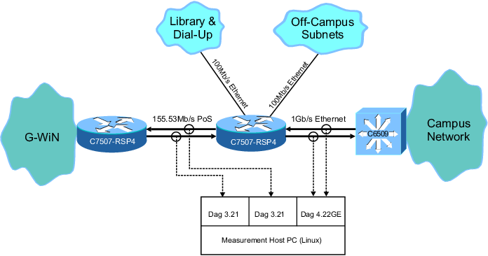
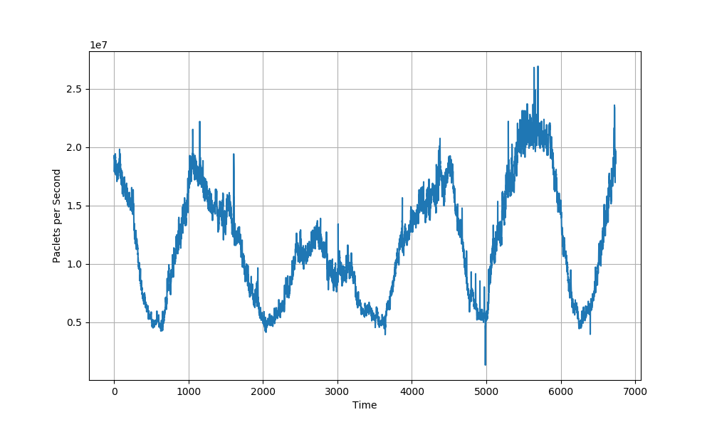
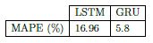
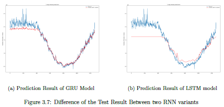
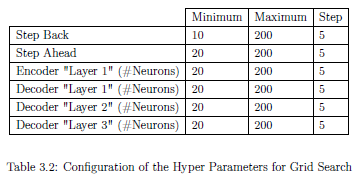
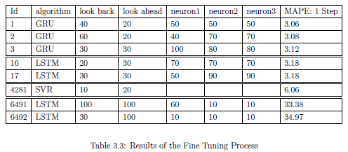

# Smart System for ML-Driven Predictive Bandwidth Management in Campus Networks

### AAA College of Engineering and Technology

By
1. Rithik K
2. Pruthiv Raman K 

---

## 📌 Problem Statement

* In campus environments, fluctuating user demand and static bandwidth allocation policies often lead to **network congestion during peak hours** and **underutilization during off-peak periods**.
* Traditional bandwidth management methods fail to adapt dynamically to real-time usage patterns and priorities.
* This project proposes the use of **machine learning algorithms** to analyze historical and live traffic data to intelligently **predict bandwidth demand** and automatically **allocate resources**, minimizing latency, ensuring efficient utilization, and enhancing user experience across **academic, administrative, and research domains**.

---

## 💡 Idea

* **Predictive Bandwidth Allocation** – Use ML models to forecast network demand based on historical and real-time traffic data.
* **Dynamic Resource Management** – Automatically adjust bandwidth allocation across departments, labs, and services according to predicted usage.
* **QoS-Aware System** – Prioritize critical applications (e.g., online exams, research data transfer) over non-critical ones during congestion.
* **Continuous Feedback Loop** – Integrate monitoring tools to refine predictions and improve decision-making accuracy over time.

---

## 🎯 Objectives

* To design a **predictive system** using ML to forecast network bandwidth demand in real time.
* To minimize **network congestion** and underutilization through **dynamic bandwidth allocation**.
* To improve **Quality of Service (QoS)** by prioritizing critical applications and services.
* To build a **scalable solution** suitable for campus-wide implementation.
* To evaluate performance using metrics like **throughput, latency, packet loss, and fairness index**.

---

## 🚀 Expected Outcome

* Reduced **congestion during peak hours** through intelligent predictive allocation.
* Enhanced **user experience** with **low latency** and **high throughput**.
* **Fair and efficient** distribution of bandwidth across departments and applications.
* Scalable solution adaptable to other large-scale networks beyond campus environments.

---

## 🔄 Project Flow Diagram

**Data Collection → Preprocessing → ML Model Training → Prediction → Dynamic Bandwidth Allocation → Monitoring & Feedback**

1. ## Data Collection 

2.  ## Data Preprocessing:

3. ## Data Normalization:
### Time Series prediction requires a set of past observations in order to estimate future values of the features of interest. Actually, there are mainly two categories as explained below: >* **One-Step Prediction**: The most straightforward strategy is one step prediction which is about taking a vector that include the last observations as input to the model responsible for yielding the prediction. Specifically, for a set of samples observed at times t0; t1; ...; tn, the value at time tn+1 is estimated. >* **Multi-Step Prediction**: Multi-Step Prediction is about predicting upper than one step ahead based on the same historical samples. Specifically, for a set of samples observed at times t0; t1; ...; tn, the values at time tn+1; tn+2; ...; tn+m are estimated.

4. ## Data Transformation:
### 1. Modeling Phase: >At first, the data set was divided into two parts, as indicated below, using Test-Set Validation technique which is the most basic strategy for estimating the reliability and the robustness of the predictive models. Indeed, we split the data into two separate portions: >* **Training Set:** It contains 80% of the original data. Hence, this portion will be used for training the predictive models. >* **Test Set:** It contains 20% of the original data. Hence, the fitted models will be validated on the Test Set.
## output 

 

5. ## Training of the Predictive Models:
### We have picked out RMSProp as an optimizer for updating the NN weights in the Gradient Descent algorithm. The selection was actually based on a rigorous benchmark of three optimizers (SGD, RMSProp and AdaGrad)

6.  ## Fine Tuning

## ✅ Conclusion

This project demonstrates the potential of **ML-driven predictive bandwidth management** in campus networks. By forecasting bandwidth demand and dynamically allocating resources, the system ensures efficient utilization and enhanced QoS. Future extensions include **integration with Software Defined Networking (SDN)** for fully automated, policy-driven smart campus networks.

